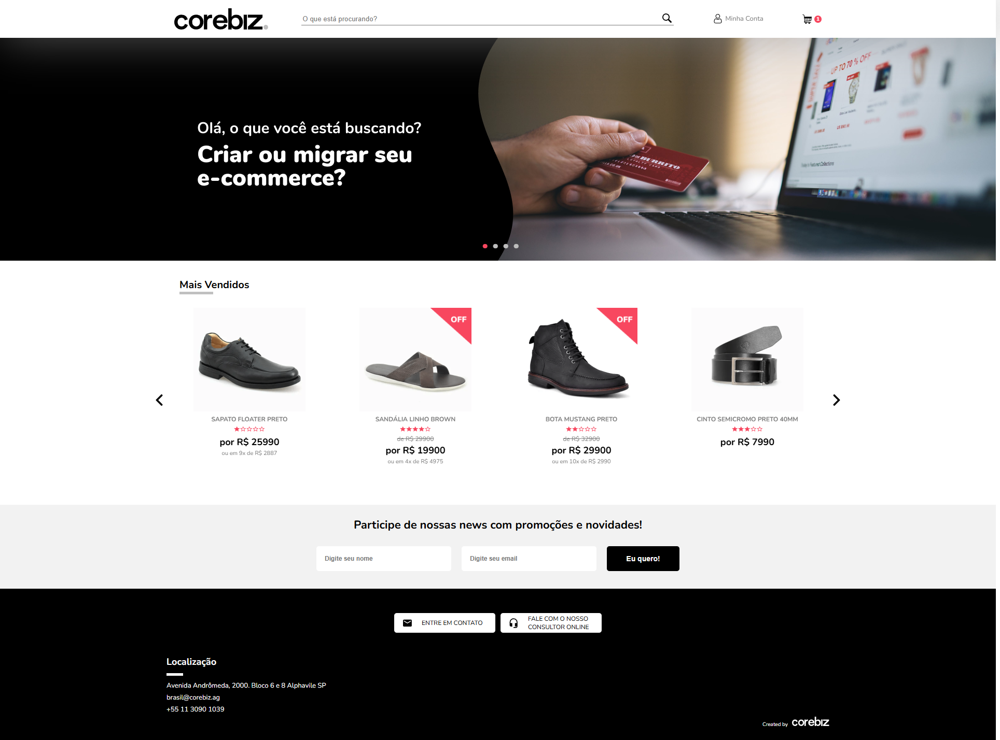

# Projeto Corebiz

Este repositório contém um projeto web desenvolvido como parte de um teste para a vaga de front-end jr I na corebiz. 

## Tecnologias Utilizadas
- **Vite JS**: Ferramenta de build.
- **React**: Biblioteca para criação de interfaces de usuário.
- **HTML**: Marcação semântica.
- **CSS**: Estilização responsiva e customizada.


## Como Rodar o Projeto

Siga os passos abaixo para executar o projeto localmente em sua máquina:

### 1. Clonar o Repositório
```bash
git clone https://github.com/souzamirella/front-end-test
```

### 2. Navegar para o Diretório do Projeto
```bash
cd front-end-test
```

### 3. Instalar Dependências
Certifique-se de ter o **Node.js** instalado em sua máquina. Em seguida, execute:
```bash
npm install
```

### 4. Rodar o Servidor de Desenvolvimento
Inicie o servidor de desenvolvimento com o comando:
```bash
npm run dev
```

### 5. Abrir no Navegador
Abra o navegador e acesse:
```
http://localhost:5173
```

O site estará rodando e você poderá explorar a interface.

## Estrutura do Projeto
- **public/**: Contém os ativos públicos, como imagens e ídolos.
- **src/**: Contém o código-fonte principal.
  - **assets/**: imagens.
  - **components/**: Componentes React reutilizáveis.
  - **pages/**: páginas do site.
  - **main.jsx**: Arquivo de entrada.


## Desktop



## Mobile
